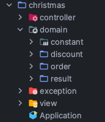

# 기능 구현 사항
> 이벤트 플래너 프로그램을 개발하는 것
> 
> 고객이 식당에 방문할 날짜와 메뉴를 미리 선택 시, 이벤트 플래너가 아래 내용들을 보여주길 바람
> - 주문 메뉴 
> - 할인 전 총 주문 금액
> - 증정메뉴
> - 혜택 내역
> - 총 혜택 금액
> - 할인 후 예상 결제 금액
> - 12월 이벤트 배지 내용
## 1. 식당 예상 방문 날짜 입력
- [x] 입력 전 메시지 출력
    - [x] 플래너 소개 메시지
    - [x] 식당 예상 방문 날짜 입력 메시지
- [x] 12월 식당 예상 방문 날짜 입력
    - [x] 숫자만 입력
    - [x] 12.1 ~ 12.31 사이의 날짜만 입력 가능 (년, 월을 제외한 일만 입력)
        - [x] 1 이상 31 이하의 숫자가 아닌 경우, `"[ERROR] 유효하지 않은 날짜입니다. 다시 입력해 주세요."` 후 재입력
            - [x] 예) `26`

## 2. 주문 메뉴와 메뉴 개수 입력
- [x] 주문 메뉴와 각 메뉴 주문 개수 입력 안내 메시지 출력
- [x] 주문 메뉴와 메뉴 개수 입력
    - [x] `메뉴-개수` 형식으로 하나의 메뉴와 메뉴의 개수를 입력
    - [x] 메뉴의 개수는 0개일 수 없다.
    - [x] 같은 메뉴를 중복 입력할 수 없다
    - [x] 메뉴에 없는 메뉴 입력 불가
    - [x] 음료만 주문할 수 없다
    - [x] 메뉴는 한 번에 최대 20개까지만 주문할 수 있다
        - [x] 시저샐러드-10, 티본스테이크-10, 제로콜라-1 인 경우 21개로 초과 (20까지 가능)
    - [x] 각 메뉴를 `,`로 구분
        - [x] 예) `타파스-1,제로콜라-1`
    - [x] 위 조건을 만족 못할 시 `"[ERROR] 유효하지 않은 주문입니다. 다시 입력해 주세요."` 출력 후 재입력
        - [x] 모든 에러는 `[ERROR]` 접두어로 시작한다

## 3. 단순 정보 출력 - 주문 메뉴 출력
- [x] 예상 방문 날짜에 받을 이벤트 혜택 미리보기 안내 메시지 출력
    - [x] 해당 날짜를 정확히 적어야 함
- [x] 개행  추가 - 안내메시지와 주문 메뉴 출력 사이
- [x] 주문 메뉴에 대한 출력
    - [x] `<주문 메뉴>` 를 한 개의 라인에 출력
    - [x] 주문 메뉴의 출력 순서는 자유롭게 한다
        - [x] 내가 원하는 경우 특정 순서를 따르도록 할 것
    - [x] 주문 메뉴와 주문 개수 출력
        - [x] 예시
            - [x] 타파스 1개
            - [x] 제로콜라 1개
- [x] 개행 추가

## 4. 단순 정보 출력 - 할인 전 총 주문 금액 계산 출력
- [x] `<할인 전 총주문 금액>` 을 한 개의 라인에 출력
- [x] 할인 전 총 주문 금액 계산
    - [x] 총 주문 금액
        - [x] (모든 메뉴에 대해) 메뉴 x 개수한 값을 더한다.
            - [x] 최대 120만원을 넘지 않으므로 Integer 자료형을 사용한다.
- [x] 할인 전 총 주문 금액을 출력
    - [x] 1000 단위마다 `,`를 넣어 출력
        - [x] 예) `142,000원`
    - [x] 총 주문 금액 뒤에 `원` 표시 추가
- [x] 개행 추가

## 5. 계산된 정보 출력 - 증정 메뉴
- [x] `<증정 메뉴>` 를 한 개의 라인에 출력
    - [x] 증정 메뉴가 없어도 해당 메시지는 출력한다.
- [x] 증정 메뉴와 개수 출력
    - [x] 예) `샴페인 1개`
    - [x] 증정 메뉴가 없는 경우 `없음` 출력
    - [x] 12만원 이상일 때 샴페인 1개를 증정한다.
        - [x] 24만원 이상이어도 1개 이상 증정하지 않는다.

## 6. 계산된 정보 출력 - 혜택 내역
- [x] `<혜택 내역>` 을 한 개의 라인에 출력
- [x] 혜택 종류와 금액 출력
    - [x] `할인종류: -x,xxx원` 형식으로 한 줄에 하나의 할인 종류 출력
        - [x] 예) `크리스마스 디데이 할인: -1,200원`
    - [x] (중요) 총 주문 금액이 10,000원 이상부터 이벤트가 적용된다
    - [x] 적용된 이벤트가 하나도 없을 경우 `없음` 출력
    - [x] 혜택 내역에 여러개의 이벤트가 적용된 경우, 출력 순서는 자유
    - [x] 크리스마스 이벤트만 혜택 25일 까지, 나머지는 31일 까지
    - [x] 디데이 할인과 특별 할인은 총 주문 금액에서 1,000원 할인
    - [x] 나머지 할인은 적용되는 제한 메뉴 개당 할인

## 7. 계산된 정보 출력 - 총 혜택 금액
- [x] `<총혜택 금액>` 을 한 개의 라인에 출력
- [x] 혜택의 금액의 총합 출력
    - [x] 예) `-31,246원`
    - [x] `총혜택 금액 = 할인 금액의 합계 + 증정 메뉴의 가격`
        - [x] 샴페인은 `25,000`원으로 샴페인을 증정받은 경우 포함됨

## 8. 계산된 정보 출력 - 할인 후 예상 결제 금액
- [x] `<할인 후 예상 결제 금액>` 라인 출력
- [x] 할인 후 예상 결제 금액 출력
    - [x] `할인 후 예상 결제 금액 = 할인 전 총주문 금액 - 할인 금액`
        - [x] 할인 금액과 혜택 금액은 다름 → 즉, 할인 금액은 ==샴페인을 제외==한 금액
    - [x] 예) `135,246원`

## 9. 계산된 정보 출력 - 12월 이벤트 배지
- [x] `<12월 이벤트 배지>` 라인 출력
- [x] 배지 종류 출력
    - [x] 배지가 없을 경우 `없음` 출력
    - [x] 총 혜택 금액에 따라 출력
        - [x] `총혜택 금액 = 할인 금액의 합계 + 증정 메뉴의 가격`
        - [x] 5천 원 이상: 별
        - [x] 1만 원 이상: 트리
        - [x] 2만 원 이상: 산타

---
# 크리스마스 프로모션

각 패키지는 MVC 패턴에 따라 구성했습니다.
구성은 다음과 같습니다

---
## constant
| 클래스명          | 타입   | 역할                                         | 비고 |
|---------------|------|--------------------------------------------|----|
| DecemberEvent | Enum | 이벤트의 종류와 이름을 표현                            |    |
| EventBadge    | Enum | 배지의 종류와 가격 기준을 표현                          |    |
| EventWeek     | Enum | 주중과 주말을 표현하고, DayOfWeek를 주중과 주말에 맞게 변수로 포함 |    |
| MenuCategory  | Enum | 메뉴의 카테고리 구분                                |    |
| MenuType      | Enum | 메뉴의 이름, 가격, 카테고리 표현                        |    |

---
## controller
| 클래스명                        | 타입    | 역할                            | 인스턴스 변수               |
|-----------------------------|-------|-------------------------------|-----------------------|
| DecemberPromotionController | Class | 이벤트 관리의 Domain, View Class 중재 | Inputview, OutputView |

---
## domain
### order

| 클래스명        | 타입             | 역할                           | 비고                       |
|-------------|----------------|------------------------------|--------------------------|
| VisitDate  | Class          | 방문날짜의 표현과 LocalDate 관련 정보 제공 |                          |
| Menu        | Abstract Class | 메뉴 정보 표현                     |                          |
| OrderMenu   | Class          | 주문 메뉴 정보 표현                  | Menu 추상클래스 상속            |
| OrderMenus  | Class          | 주문 메뉴 정보의 일급 리스트             |                          |
| Reservation | Class          | 주문 날짜와 주문 메뉴에 대한 정보 표현       | OrderMenus와 VisitDate 포함 |
### discount

| 클래스명                       | 타입             | 역할                                   | 비고                 |
|----------------------------|----------------|--------------------------------------|--------------------|
| Discount                  | Class          | 할인의 종류와 할인 가격 표현                     |                    |
| Gift                       | Class          | 증정 메뉴의 종류와 개수 표현                     | Menu 추상클래스 상속      |
| DiscountDirector           | Class          | 할인 로직들의 사용자 클래스로, 할인 로직의 실행 의 진입점    | 템플릿 메소드 사용         |
| DiscountBuilder            | Abstract Class | DiscountDirector가 실행하는 할인 로직의 추상 클래스 |                    |
| ChristmasDiscountBuilder   | Class          | 크리스마스 할인 로직                          | DiscountBuilder 상속 |
| SpecialStarDiscountBuilder | Class          | 특별 할인 로직                             | DiscountBuilder 상속 |
| WeekDayDiscountBuilder     | Class          | 주중 할인 로직                             | DiscountBuilder 상속 |
| WeekEndDiscountBuilder     | Class          | 주말 할인 로직                             | DiscountBuilder 상속 |
| GiftGenerator              | Interface      | 증정 로직의 슈퍼클래스                         |                    |
| ChampagneGiftGenerator     | Class          | 샴페인 증정 로직                            | GiftGenerator 상속   |
| DiscountFactory            | Enum           | 할인 로직의 생성을 담당하는 Enum 팩토리 메소드         |                    |
### result
| 클래스명        | 타입    | 역할               | 비고                       |
|-------------|-------|------------------|--------------------------|
| EventResult | Class | 이벤트 결과에 대한 정보 제공 | Discount 리스트와 Gift리스트 포함 |

---
## view

| 클래스명       | 타입    | 역할                | 비고 |
|------------|-------|-------------------|----|
| Inputview  | Class | 게임 콘솔 화면 입력 스캔 역할 |    |
| OutputView | Class | 게임 콘솔 화면 출력 역할    |    |

---
# 고민한 부분

[Velog](https://velog.io/@wns312/4%EC%A3%BC%EC%B0%A8-%ED%94%84%EB%A6%AC%EC%BD%94%EC%8A%A4-%ED%9A%8C%EA%B3%A0)에 회고를 작성했습니다!
